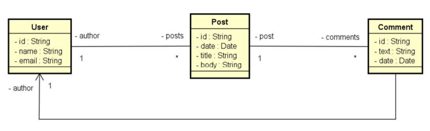

# Spring Boot e JPA/Hibernate - MongoDB - NoSQL | Web services 

## Descrição

O projeto em `Springboot e JPA` desenvolvido consiste em uma aplicação que implementa o modelo de domínio e estrutura em camadas lógicas de recursos, serviços e repositórios. O objetivo é simular o `back-end` de uma timeline de rede social.
Dentre as característcas do projeto, os principais consistem em:

- Operações internas ao Banco de Dados: 
  - CRUD - Create, Retrieve, Update, Delete
- Implementar associações entre objetos:
  - Objetos aninhados
  - Referências
- Entender a arquitetura e design da API com banco de dados orientado a documentos
- Criação de tratamento de exceções personalizadas
- Criação de endpoints para consumo da API e testes pelo software `Postman`

## Tecnologias utilizadas
- Java
- Spring Boot
- JPA / Hibernate
- Maven
- MongoDB Compass
- Postman
### Banco de dados
- MongoDB

## Modelo conceitual


# Executando o projeto

```bash
# clonar repositório
git clone https://github.com/lucasnatanmelo/Spring-Boot-e-JPA-Hibernate-MongoDB.git

# acessar a pasta 
cd Springboot-MongoDB

# executar o projeto
./mvnw spring-boot:run
```

## API - endpoints

- ## Users:
  - **GET:** `/users`
    - Retorna todos os usuários cadastrados.
  - **GET:** `/users/{id}`
    - Retorna o usuário correspondente ao ID informado.
  - **POST :** `/users`
    - Cadastra um novo usuário.
  - **DELETE :** `/users/{id}`
    - Exclui o usuário correspondente ao ID informado.
  - **PUT :** `/users/{id}`
    - Atualiza os dados do usuário correspondente ao ID informado.
  - **GET  :** `/users/{id}/posts`
    - Retorna todos os posts do usuário correspondente ao ID informado.

- ## Posts:
  - **GET:** `/posts/{id}` 
    - Retorna o post correspondente ao ID informado.
  - **GET:** `/posts/titlesearch?text={text}` 
    - Retorna todos os posts que contém o texto informado no título.
  - **GET:** `/posts/fullsearch?text={text}&minDate={minDate}&maxDate={maxDate}` 
    - Retorna todos os posts que contém o texto informado no título e foram criados entre as datas mínima e máxima informadas. A data mínima e a data máxima são opcionais, se não forem informadas, a busca é feita por todos os posts que contém o texto informado.

